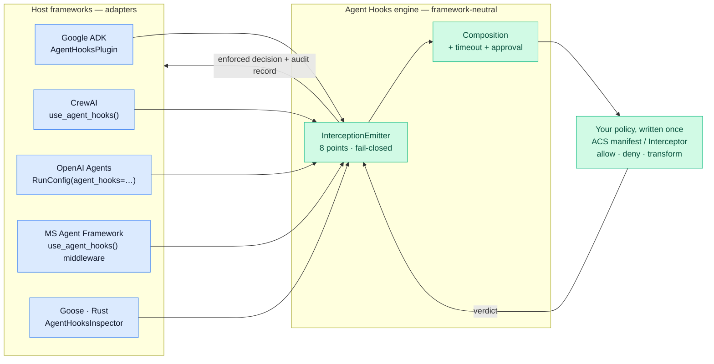
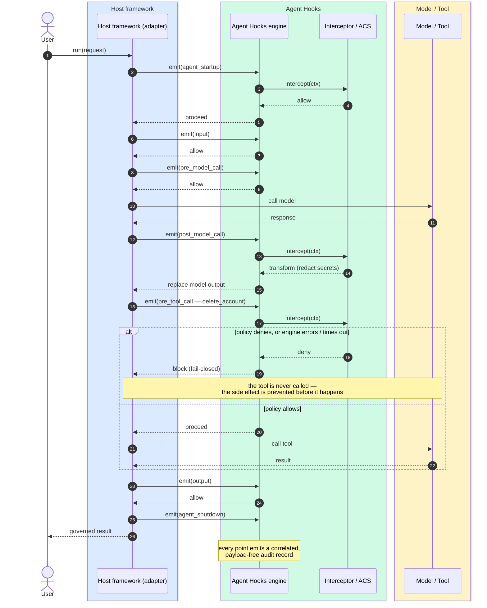
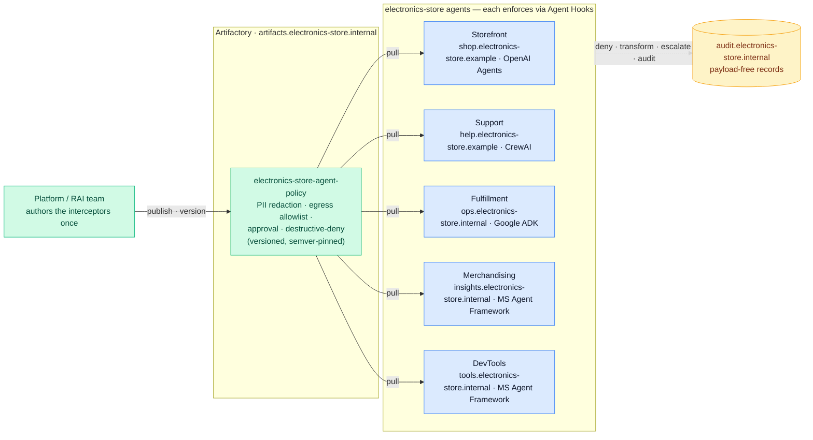

# Agent Hooks: one governance contract for every agent framework

**Write your agent policy once. Enforce it in multiple frameworks.**

---

## Contents

- [The problem](#the-problem)
- [The idea](#the-idea)
  - [The eight interception points](#the-eight-interception-points)
  - [The verdicts](#the-verdicts)
- [How it fits every framework](#how-it-fits-every-framework)
- [How a governed run flows](#how-a-governed-run-flows)
- [In practice: one retail org](#in-practice-one-retail-org)
- [Where to go next](#where-to-go-next)

---

## The problem

There is no standard specification for enforcing agent policy across agent
frameworks. In that vacuum, every framework is building its own guardrail system,
with framework-specific interception points, context, verdicts, failure behavior,
approvals, and audit records. A guardrail written for an agent in one framework
cannot be reused as the same enforceable policy for an agent in another.

Teams must therefore rewrite the same guardrails for every framework their agents
use: deny destructive tools, redact secrets from model output, require approval
for risky actions, and produce an audit trail. Each copy can behave differently,
drift out of sync, or fail in a different way, even when the security and
compliance policy is supposed to be identical everywhere.

Framework-native lifecycle hooks do not provide the missing standard. They are
useful *application* extension points, but each framework defines its own contract
and failure semantics. There is no shared verdict, timeout, approval, or audit
contract that every host is obligated to enforce.

## The idea

**Agent Hooks** is a single, framework-neutral governance contract. You write an
interceptor (or point an [ACS](https://github.com/microsoft/agent-governance-toolkit)
manifest) at it once, and any host that speaks the contract enforces it
identically:

1. **Eight fixed lifecycle interception points** — a JSON-shaped context at each
   ([spec §3](../spec/AGENT-HOOKS-0.1.md#3-interception-points)).
2. **A three-verdict model** — `allow`, `transform`, `deny`. A *warning* is an
   `allow` that carries metadata and an *escalation* is a `deny` an approver can
   lift, so neither is a separate state
   ([spec §5](../spec/AGENT-HOOKS-0.1.md#5-verdict)).
3. **Fail-closed by construction** — a policy error, timeout, or invalid transform
   becomes a *deny*, never an implicit allow
   ([spec §6.3](../spec/AGENT-HOOKS-0.1.md#63-failure-handling)).
4. **Payload-free audit records** — every decision is correlated and traceable
   ([spec §10.3](../spec/AGENT-HOOKS-0.1.md#103-the-interception-record)).

Each framework stays the **host adapter**: it owns the call sites, builds the
context, and enforces the returned verdict. Agent Hooks is the portable
**policy engine** the host consults and is obligated to honor — it does not
replace native hooks, it gives them the one job they were never meant to do.

Putting policy *inside* an application hook forces one seam to serve both
masters — and, because those hooks are fail-open by design, to silently swallow a
governance failure. Agent Hooks keeps the seams separate so each retains its own
failure mode, owner, and audit trail.

> **Trust model.** Agent Hooks is a *cooperative contract, not a security
> boundary*. The host and the interceptors it registers are trusted, and nothing
> in the contract detects a host that skips interception points or ignores a
> verdict; it is not a sandbox around untrusted code. See
> [spec §1.4](../spec/AGENT-HOOKS-0.1.md#14-trust-model-and-non-goals) and
> [THREAT-MODEL.md](THREAT-MODEL.md).

### The eight interception points

| # | Point | Fires when | Governs |
| --- | --- | --- | --- |
| 1 | `agent_startup` | a run begins | admit or reject the run |
| 2 | `input` | a user message arrives | untrusted user input |
| 3 | `pre_model_call` | before each LLM call | the outbound prompt / request |
| 4 | `post_model_call` | after each LLM response | model output (redact / rewrite) |
| 5 | `pre_tool_call` | before each tool call | the tool and its args — **before the side effect** |
| 6 | `post_tool_call` | after each tool result | tool output |
| 7 | `output` | the final response | what actually reaches the caller |
| 8 | `agent_shutdown` | a run ends | terminal state and audit summary |

Ordering is normative and each `pre_*` pairs with one `post_*`; the full context
schema and the per-point `transform` target live in
[spec §3–§4](../spec/AGENT-HOOKS-0.1.md#3-interception-points) and the
[Interception points](../docs-site/docs/concepts/interception-points.md) concept
page.

### The verdicts

An interceptor returns exactly one of **three** decisions.

| Decision | Class | Host obligation |
| --- | --- | --- |
| `allow` | permit | proceed with the target unchanged |
| `transform` | permit | proceed with a policy-supplied replacement (redacted prompt, rewritten output, safe args) |
| `deny` | block | halt the action; at `post_*` points, discard the already-produced result |

Two shapes ride on those decisions instead of adding new ones — this is what keeps
fail-closed a property of the type:

- **Warning** — an `allow` carrying a `warnings` array. It is recorded but never
  changes control flow (`Verdict.warn(...)` is SDK sugar for it).
- **Escalation** — a `deny` carrying an `approval` block: denied as-is unless the
  [approval seam](../docs-site/docs/concepts/approval.md) lifts it. A host with no
  approver enforces it as a plain deny.

See [spec §5](../spec/AGENT-HOOKS-0.1.md#5-verdict) and the
[Verdicts](../docs-site/docs/concepts/verdicts.md) concept page for the aggregation
order and validation rules.

## How it fits every framework

The same policy object plugs into five different hosts. Only the one-line
registration changes.

| Framework | Drop-in |
| --- | --- |
| **Google ADK** | `App(plugins=[AgentHooksPlugin(interceptors=[policy])])` |
| **CrewAI** | `with use_agent_hooks(policy): crew.kickoff()` |
| **OpenAI Agents** | `Runner.run(..., run_config=RunConfig(agent_hooks=AgentHooksConfig(interceptors=[policy])))` |
| **Microsoft Agent Framework** | `Agent(client=..., middleware=use_agent_hooks(policy))` |
| **Goose** (Rust) | `install(\|\| AgentHooksInspector::builder().register(policy).build())` |

Each adapter ships in its own framework project; this repo holds the engine and
the language SDKs (Python, TypeScript, Rust, .NET, Go). To build a host or an
interceptor, start from a [quickstart](../docs-site/docs/quickstart/python.md).

## How a governed run flows

A single run touches every lifecycle point. At each one the host emits a context
to the engine, the engine runs your policy, and the host enforces the verdict —
blocking a denied side effect *before* it happens and redacting output *before*
it leaves the process.

## In practice: one retail org

**electronics-store** — an online electronics retailer — runs agents across five teams on four
different frameworks. Governance is not written five times: the same Agent Hooks
interceptors, versioned once in an internal `electronics-store-agent-policy` package,
plug into every host.

| Team / agent | Domain | Framework | Reused org policy |
| --- | --- | --- | --- |
| Storefront shopping assistant | `shop.electronics-store.example` | OpenAI Agents | PII redaction · egress allowlist · injection deny |
| Customer-support agent | `help.electronics-store.example` | CrewAI | refund approval · PII redaction · audit |
| Fulfillment & warehouse ops | `ops.electronics-store.internal` | Google ADK | destructive-tool deny · stock-write approval |
| Merchandising & pricing analyst | `insights.electronics-store.internal` | MS Agent Framework | data-domain allowlist · no-write guardrail |
| Internal DevTools agent | `tools.electronics-store.internal` | MS Agent Framework | `pre_tool_call` deny on prod-touching commands |

Four interceptors, written once, cover every agent above:

1. **PII / PCI redaction** — at `post_model_call` and `output`, strip customer
  PII and any card data flowing from `payments.electronics-store.example`, so it never
   reaches the model or the caller.
2. **Egress allowlist** — at `pre_tool_call`, `deny` any HTTP tool whose host is
  not under `*.electronics-store.example` or `*.electronics-store.internal`; a support agent
   can't be steered into calling `pastebin.example`.
3. **Human approval for money & inventory** — refunds over a threshold or stock
   writes `escalate` for sign-off before the side effect runs.
4. **Destructive-action deny + audit** — `delete_*` / `drop_*` / prod deploys are
   denied outright, and every decision emits a payload-free record to
  `audit.electronics-store.internal`.

## Where to go next

- **Specification** — [Agent Hooks 0.1](../spec/AGENT-HOOKS-0.1.md), the normative
  RFC-2119 contract.
- **Concepts** — [Interception points](../docs-site/docs/concepts/interception-points.md) ·
  [Verdicts](../docs-site/docs/concepts/verdicts.md) ·
  [Composition profiles](../docs-site/docs/concepts/composition.md) ·
  [Approval seam](../docs-site/docs/concepts/approval.md) ·
  [Interception records](../docs-site/docs/concepts/records.md).
- **Quickstarts** — build a host or interceptor in
  [Python](../docs-site/docs/quickstart/python.md),
  [TypeScript](../docs-site/docs/quickstart/typescript.md),
  [Rust](../docs-site/docs/quickstart/rust.md),
  [.NET](../docs-site/docs/quickstart/dotnet.md), or
  [Go](../docs-site/docs/quickstart/go.md).
- **Trust model & threats** —
  [spec §1.4](../spec/AGENT-HOOKS-0.1.md#14-trust-model-and-non-goals) and
  [THREAT-MODEL.md](THREAT-MODEL.md).
- **Ecosystem interop** — [MCP and A2A mapping](INTEROP.md).
- **Controls mapping** — [OWASP / NIST](CONTROLS-MAPPING.md).
- **Running it in production** — [PRODUCTION.md](PRODUCTION.md) and
  [OPERATIONS.md](OPERATIONS.md).
- **FAQ** — [common questions](../docs-site/docs/faq.md).

---

**Write policy once. Run it in every agent your organization ships.**
